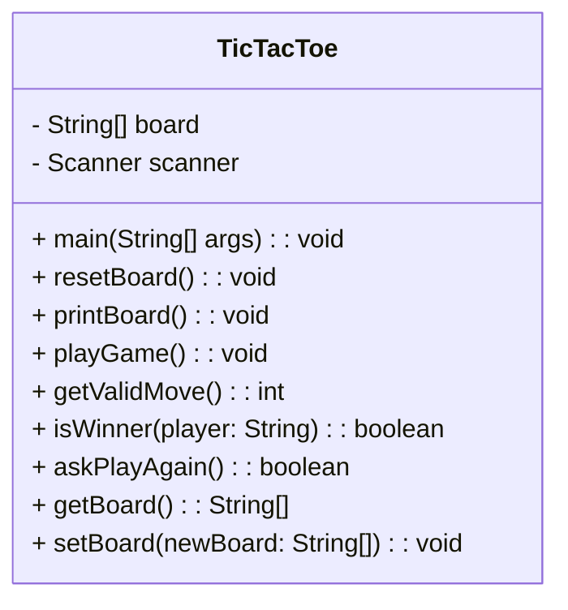

# Tic-Tac-Toe Console Game (Java)

This project implements a human versus human Tic-Tac-Toe game played in the console with a 3x3 grid numbered 1 to 9. Player 1 uses “X” and Player 2 uses “O”.

To set up, clone the repository with `git clone https://github.com/YOUR_USERNAME/tic-tac-toe.git` then run `./gradlew build` to compile and `./gradlew run` to start the game.

Players alternate turns entering the number corresponding to their move; the program validates input to reject invalid, occupied, or out-of-range entries without crashing.

The game detects wins (rows, columns, diagonals) and draws, announces results, and prompts to play again.

Unit tests written with JUnit 5 cover initial board setup, win conditions, draw detection, and input validation. Run tests via `./gradlew test`; reports are generated at `build/reports/tests/test/index.html`.

Reviewers should confirm that the game runs correctly from the console, enforces rules, handles invalid input gracefully, declares outcomes properly, and offers replay.

The code uses a single class (`TicTacToe.java`) focusing on MVP design with clear separation of concerns planned for future iterations.




```mermaid
sequenceDiagram
    participant User
    participant Main
    participant GameLoop
    participant Input
    participant BoardLogic

    User->>Main: Start program (main)
    Main->>GameLoop: playGame()

    loop Until game ends
        GameLoop->>Input: getValidMove()
        Input->>User: Prompt for move
        User-->>Input: Enter move
        Input->>Input: Validate move
        Input->>GameLoop: Return valid move

        GameLoop->>BoardLogic: Update board
        GameLoop->>BoardLogic: isWinner(currentPlayer)
        BoardLogic-->>GameLoop: Return true/false

        alt Player wins
            GameLoop->>User: Announce winner
            break
        else Draw
            GameLoop->>User: Announce draw
            break
        else Continue
            GameLoop->>GameLoop: Switch player
        end
    end

    GameLoop->>User: Ask to play again
```